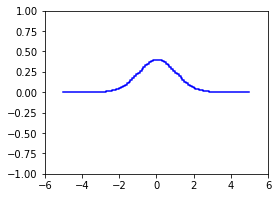

The package `step` is a Python implementation of the algebra of step functions.

# Usage

## Intervals

A binary-valued step function can be thought of as a union of disjoint half-open intervals. This special case is implemented in the class `UnionOfIntervals`.

### Initialization

```
>>> from step import UnionOfIntervals
>>> i = UnionOfIntervals.from_pairs(((-4, -2), (2, 4)))
>>> j = UnionOfIntervals.from_pairs(((-5, -3), (-1, 1), (3, 5)))
>>> i
UnionOfIntervals([-4.0, -2.0) U [2.0, 4.0))
>>> j
UnionOfIntervals([-5.0, -3.0) U [-1.0, 1.0) U [3.0, 5.0))
```

### Operations

#### complementation

```
>>> ~i
UnionOfIntervals([-inf, -4.0) U [-2.0, 2.0) U [4.0, inf))
```

#### intersection

```
>>> i & j
UnionOfIntervals([-4.0, -3.0) U [3.0, 4.0))
```

#### union

```
>>> i | j
UnionOfIntervals([-5.0, -2.0) U [-1.0, 1.0) U [2.0, 5.0))
```

#### list of operations: intervals

| operation   | description |
| ----------- | ------------|
| `~i`        | complementation |
| `i & j	`     | intersection |
| <code>i &#124; j</code> | union |
| `i - j`     | set difference |
| `i ^ j`     | symmetric difference |
| `i <= j`    | inclusion |
| `i < j`     | strict inclusion |
| `i(a)`      | membership |

## Step Functions

Step functions are implemented in the class `StepFunction`.

### Initialization

```
>>> from step import StepFunction
>>> x = StepFunction.from_intervals(i)
>>> x
StepFunction(1.0[-4.0, -2.0) + 1.0[2.0, 4.0))
>>> y = 0.1 * StepFunction.approx(square, start=-5, stop=5, num_steps=20)
>>> y
StepFunction(2.5[-5.0, -4.5) + 2.025[-4.5, -4.0) + 1.6[-4.0, -3.5) + ...)
```


### Operations

#### addition

```
>>> x + y
StepFunction(2.5[-5.0, -4.5) + 2.025[-4.5, -4.0) + 2.6[-4.0, -3.5) + ...)
```


#### multiplication

```
>>> x * y
StepFunction(1.6[-4.0, -3.5) + 1.225[-3.5, -3.0) + 0.9[-3.0, -2.5) + ...)
```


#### list of operations: step functions

| operation   | description |
| ----------- | ------------|
| `-x`        | negation |
| `abs(x)`    | absolute value |
| `x.ppart()` | Jordan decomposition (positive) |
| `x.npart()` | Jordan decomposition (negative) |
| `x.supp()`  | support |
| `x.ker()`   | kernel  |
| `x.preimg(a)` | preimage | 
| `x.pset()`  | Hahn decomposition (positive) |
| `x.nset()`  | Hahn decomposition (negative) |
| `x + y	`     | addition |
| `x - y`     | subtraction |
| `x * y`     | multiplication |
| `a * x	`     | scalar multiplication |
| `x // y`    | Lebesgue decomposition (abs. continuous) |
| `x % y`     | Lebesgue decomposition (singular) |
| `x & y`     | minimum |
| <code>x &#124; y</code> | maximum |
| `x <= y`    | pointwise order |
| `x < y`     | strict pointwise order |
| `x(a)`      | evaluation |
|  `x @ y`    | L2 inner product |

## Probability
### Measure and Integration
Every step function *f* determines a signed measure *m* whose integral is given by the formula

<center> ∫ *m*(dx) *g*(x) = ∫ dx *f*(x) *g*(x). </center>

Step functions integrate other step functions using the matrix multiplication operator `@`.

```
>>> x @ y
3.75
```

Step functions can can also measure intervals.

```
>>> x @ i
4.0
```

To perform ordinary integration, import the measure `leb`.

```
>>> from step import leb
>>> leb @ y
8.375
```

### Expectation

If a step function *f* is nonnegative and integrates to 1, then it is the probability density function (PDF) of a probability measure.

The expected value of a step function with regard to this measure is computed using the matrix multiplication operator `@`.

```
>>> E = x / (leb @ x)
>>> leb @ E
1.0
>>> E @ y
0.9375
```

If the step function `y` is normally distributed, then we can approximate its expected value thus:

```
>>> from scipy.stats import norm
>>> N = StepFunction.approx(norm.pdf, start=-5, stop=5, num_steps=100)
```


```
>>> N @ y
0.10599839875582517
```

### Pullback

If *f* is a step function, than any composite function *h* of the form *h* = *g*∘*f* is itself a step function. The set of all such composite functions is a finite dimensional vector space.

Using the function `pullback`, we can obtain a composition operator K that maps R^n into this vector space.

```
>>> from step import StepFunction
>>> z = StepFunction.from_triples(((1, -4, -2), (2, 0, 2), (3, 2, 4)))
>>> z
StepFunction(1[-4.0, -2.0) + 2[-1.0, 1.0) + 3[2.0, 4.0))
```



```
>>> from step import pullback
>>> K, v = pullback(z)
>>> K
Pullback(dom=R4)
>>> v
array([0, 1, 2, 3])
```

Composition is performed using the matrix multiplication operator `@`.

```
>>> w = K @ (0, -3, -2, -3)
>>> w
StepFunction(-3[-4.0, -2.0) + -2[-1.0, 1.0) + -3[2.0, 4.0))
```


The array `v` satisfies the equality `z == K @ v`.

```
>>> z == K @ v
True
```

### Pushforward

``TODO`