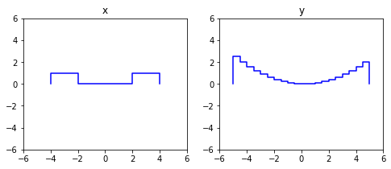

The package `step` is a Python implementation of the algebra of step functions.

# Usage

## Intervals

A binary-valued step function can be thought of as a union of disjoint half-open intervals. This special case is implemented in the class `UnionOfIntervals`.

### Initialization

```
>>> from step import UnionOfIntervals
>>> i = UnionOfIntervals.from_pairs(((-4, -2), (2, 4)))
>>> j = UnionOfIntervals.from_pairs(((-5, -3), (-1, 1), (3, 5)))
>>> i
UnionOfIntervals([-4.0, -2.0) U [2.0, 4.0))
>>> j
UnionOfIntervals([-5.0, -3.0) U [-1.0, 1.0) U [3.0, 5.0))
```

### Operations

#### complementation

```
>>> ~i
UnionOfIntervals([-inf, -4.0) U [-2.0, 2.0) U [4.0, inf))
```

#### intersection

```
>>> i & j
UnionOfIntervals([-4.0, -3.0) U [3.0, 4.0))
```

#### union

```
>>> i | j
UnionOfIntervals([-5.0, -2.0) U [-1.0, 1.0) U [2.0, 5.0))
```

#### list of operations: intervals

| operation   | description |
| ----------- | ------------|
| `~x`        | complementation |
| `x & y	`     | intersection |
| `x | y`     | union |
| `x - y`     | set difference |
| `x ^ y`     | symmetric difference |
| `x <= y`    | inclusion |
| `x < y`     | inclusion (strict) |
| `x(0)`      | membership |
|  x.leb()    | measure |

## Step Functions

Step functions are implemented in the class `StepFunction`.

### Initialization

```
>>> from step import StepFunction
>>> from math import sin
>>> x = StepFunction.from_intervals(i, y_dtype='float')
>>> x
StepFunction(1.0[-4.0, -2.0) + 1.0[2.0, 4.0))
>>> y = StepFunction.approx(sin, start=-5, stop=5, num_steps=20)
>>> y
>>> StepFunction(0.9589242746631385[-5.0, -4.5) + 0.977530117665097[-4.5, -4.0) + 0.7568024953079282[-4.0, -3.5) + ...)
```



### Operations

#### addition

```
>>> x + y
StepFunction(0.9589242746631385[-5.0, -4.5) + 0.977530117665097[-4.5, -4.0) + 1.7568024953079282[-4.0, -3.5) + ...)
```


#### multiplication

```
>>> x * y
StepFunction(0.7568024953079282[-4.0, -3.5) + 0.35078322768961984[-3.5, -3.0) + -0.1411200080598672[-3.0, -2.5) + ...)
```


#### list of operations: step functions

| operation   | description |
| ----------- | ------------|
| `-x`        | negation |
| `abs(x)`    | absolute value |
| `x.ppart()` | Jordan decomposition (positive) |
| `x.npart()` | Jordan decomposition (negative) |
| `x.supp()`  | support |
| `x.pset()`  | Hahn decomposition (positive) |
| `x.nset()`  | Hahn decomposition (negative) |
| `x + y	`     | addition |
| `x - y`     | subtraction |
| `x * y`     | multiplication |
| `x // y`    | Lebesgue decomposition (absolutely continuous) |
| `x % y`     | Lebesgue decomposition (singular) |
| `x & y`     | minumum |
| `x | y`     | maximum |
| `x <= y`    | pointwise order |
| `x < y`     | pointwise order (strict) |
| `x(0)`      | evaluation |
|  `x.leb()`  | integration |
|  `x @ y`    | L2 inner product |

## Composite Functions
...
