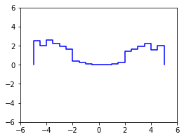

The package `step` is a Python implementation of the algebra of step functions.

# Usage

## Intervals

A binary-valued step function can be thought of as a union of disjoint half-open intervals. This special case is implemented in the class `UnionOfIntervals`.

### Initialization

```
>>> from step import UnionOfIntervals
>>> i = UnionOfIntervals.from_pairs(((-4, -2), (2, 4)))
>>> j = UnionOfIntervals.from_pairs(((-5, -3), (-1, 1), (3, 5)))
>>> i
UnionOfIntervals([-4.0, -2.0) U [2.0, 4.0))
>>> j
UnionOfIntervals([-5.0, -3.0) U [-1.0, 1.0) U [3.0, 5.0))
```

### Operations

#### complementation

```
>>> ~i
UnionOfIntervals([-inf, -4.0) U [-2.0, 2.0) U [4.0, inf))
```

#### intersection

```
>>> i & j
UnionOfIntervals([-4.0, -3.0) U [3.0, 4.0))
```

#### union

```
>>> i | j
UnionOfIntervals([-5.0, -2.0) U [-1.0, 1.0) U [2.0, 5.0))
```

#### list of operations: intervals

| operation   | description |
| ----------- | ------------|
| `~i`        | complementation |
| `i & j	`     | intersection |
| <code>i &#124; j</code> | union |
| `i - j`     | set difference |
| `i ^ j`     | symmetric difference |
| `i <= j`    | inclusion |
| `i < j`     | strict inclusion |
| `i(a)`      | membership |

## Step Functions

Step functions are implemented in the class `StepFunction`.

### Initialization

```
>>> from step import StepFunction
>>> x = StepFunction.from_intervals(i)
>>> x
StepFunction(1.0[-4.0, -2.0) + 1.0[2.0, 4.0))
>>> y = 0.1 * StepFunction.approx(square, start=-5, stop=5, num_steps=20)
>>> y
StepFunction(2.5[-5.0, -4.5) + 2.025[-4.5, -4.0) + 1.6[-4.0, -3.5) + ...)
```


### Operations

#### addition

```
>>> x + y
StepFunction(2.5[-5.0, -4.5) + 2.025[-4.5, -4.0) + 2.6[-4.0, -3.5) + ...)
```



#### multiplication

```
>>> x * y
StepFunction(1.6[-4.0, -3.5) + 1.225[-3.5, -3.0) + 0.9[-3.0, -2.5) + ...)
```


#### list of operations: step functions

| operation   | description |
| ----------- | ------------|
| `-x`        | negation |
| `abs(x)`    | absolute value |
| `x.ppart()` | Jordan decomposition (positive) |
| `x.npart()` | Jordan decomposition (negative) |
| `x.supp()`  | support |
| `x.ker()`   | kernel  |
| `x.preimg(a)` | preimage | 
| `x.pset()`  | Hahn decomposition (positive) |
| `x.nset()`  | Hahn decomposition (negative) |
| `x + y	`     | addition |
| `x - y`     | subtraction |
| `x * y`     | multiplication |
| `a * x	`     | scalar multiplication |
| `x // y`    | Lebesgue decomposition (abs. continuous) |
| `x % y`     | Lebesgue decomposition (singular) |
| `x & y`     | minimum |
| <code>x &#124; y</code> | maximum |
| `x <= y`    | pointwise order |
| `x < y`     | strict pointwise order |
| `x(a)`      | evaluation |
|  `x @ y`    | L2 inner product |

## Probability

### Integration

Integration is performed using the object `leb` and the matrix multiplication operator `@`.

```
>>> from step import leb
>>> leb @ y
8.375
```

#### Expectation

All step functions *f* can be regarded as random variables. If a step function *g* is nonnegative and integrates to 1, then it can be regarded as the probability density function (PDF) of a probability distribution.

Suppose we define

```
>>> E = x / (leb @ x)
>>> E
StepFunction(0.25[-4.0, -2.0) + 0.25[2.0, 4.0))
```


Then the step function `E` is positive and integrates to 1. If the step function `y` were distributed according to `E`, then its expectation would be computed using the matrix multiplication operator `@`.

```
>>> E @ y
0.9375
```

If, on the other hand, the step function `y` were normally distributed, than we could estimate its expectation as follows:

```
>>> from scipy.stats import norm
>>> N = StepFunction.approx(norm.pdf, start=-5, stop=5, num_steps=100)
```


```
>>> N @ y
0.10599839875582517
```

### Pushforward and Pullback

...